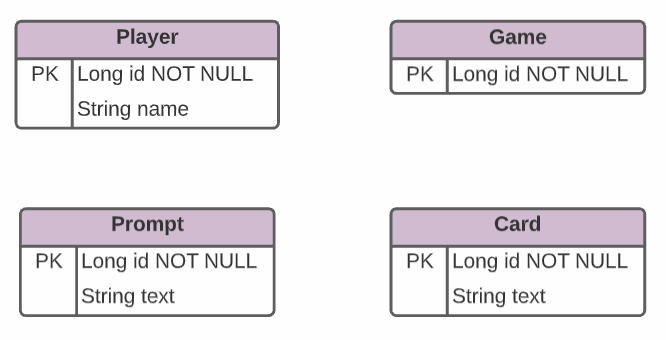

# Card Game API

This is a Cards Against Humanity inspired game API.

## Technologies

#### Version Control

  - WSL
  - Git
  - Github

#### Development
  
  - IntelliJ
  - Spring Boot
  - Postman
  - PgAdmin 

#### Planning

- Google Docs
- Trello
- LucidChard (ERD)

#### Communication

- Slack
- Zoom

## General Approach

- Plan
- Design
- Get project approval
- Develop
- Adjust design and plan
- Repeat develop and adjust

## User Stories

**As a player, I want to...**

- Look at all available players before starting a game.
- Look up a single player by their player id.
- Add a name so that I can be uniquely identified while playing.
- Update my player name if I want to change it or made a mistake when entering.
- Delete a player so I can clear unused or unnecessary players from the players list.
- Draw up to 10 cards so that I have a full hand of 10 cards.
- Draw a prompt so I can judge the responses.
- Play a card so my response can be judged.
- Choose winning card so that the winning player can be awarded a point.
- See player scores so that I can keep track of who is winning.
- See a message announcing the winning player so that all players know who won.
- Reset the game so that I don’t have to reload the application just to begin a new game.

## ERD

## Endpoints

| Request Type | URL                         | Request Body | Functionality                          |
|--------------|-----------------------------|--------------|----------------------------------------|
| GET          | /api/player                 | None         | Get all players                        |
| GET          | /api/player/{playerId}      | None         | Get single player                      |
| POST         | /api/player                 | Player name  | Create new player                      |
| PUT          | /api/player/{playerId}      | Player name  | Update player                          |
| DELETE       | /api/player/{playerId}      | None         | Delete player                          |
| GET          | /api/player/{playerId}/draw | None         | Randomly draw up to 10 cards from list |
| POST         | /api/player/start           | None         | Start the game                         |

## Dependencies

- Database "mygameapp".
- pgAdmin or similar database management software for importing the CSVs for Card and Prompt.

## Hurdles

- Design was tough because it was so different from what we did in class.
- We learned a lot during implementation that would have affected our design and approach had we known prior.

## Wins

- We're proud of the game logic!
  - This game is something we both really enjoy.
  - We were proud that we produced a working version worth sharing with the class.
- It runs.
- It's clean.

## What We Would Do Differently

- ERD design.
  - Upon starting the work, we realized our original ERD didn't make sense for our use-case.

## What We Would Do Next

- Ability for players to add custom cards
- Save/Resume game

## What We Learned

- List data structure is immutable - had to use ArrayLists for deck.
- @Transient annotation.
    - We can track fields that are not persisted in the database using this annotations.
- Our understanding of endpoints has dramatically improved.
- Better understanding of model and service layers.
- Better understanding of ERDs.
- Git pull/branching.