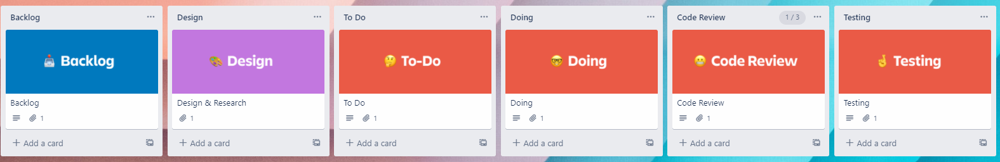

# Card Game API

This is a Cards Against Humanity inspired game API.

## Technologies

#### Version Control

  - WSL
  - Git
  - Github

#### Development
  
  - IntelliJ
  - Spring Boot
  - Postman
  - PgAdmin 

#### Planning

- Google Docs
- Trello
- LucidChard (ERD)

#### Communication

- Slack
- Zoom

## General Approach

- Plan
- Design
- Get project approval
- Develop
- Adjust design and plan
- Repeat develop and adjust

## Planning

We used a kanban board to break our project up into smaller deliverables and moved each along the track as we worked to complete them.

## User Stories

**As a player, I want to...**

- Look at all available players before starting a game.
- Look up a single player by their player id.
- Add a name so that I can be uniquely identified while playing.
- Update my player name if I want to change it or made a mistake when entering.
- Delete a player so I can clear unused or unnecessary players from the players list.
- Draw up to 10 cards so that I have a full hand of 10 cards.
- Draw a prompt so I can judge the responses.
- Play a card so my response can be judged.
- Choose winning card so that the winning player can be awarded a point.
- See player scores so that I can keep track of who is winning.
- See a message announcing the winning player so that all players know who won.
- Reset the game so that I don’t have to reload the application just to begin a new game.

## Endpoints

| Request Type | URL                         | Request Body        | Functionality                          |
|--------------|-----------------------------|---------------------|----------------------------------------|
| GET          | /api/player                 | None                | Get all players                        |
| GET          | /api/player/{playerId}      | None                | Get single player                      |
| POST         | /api/player                 | Player name         | Create new player                      |
| PUT          | /api/player/{playerId}      | Player name         | Update player                          |
| DELETE       | /api/player/{playerId}      | None                | Delete player                          |
| GET          | /api/player/{playerId}/draw | None                | Randomly draw up to 10 cards from list |
| POST         | /api/player/start           | ArrayList playerIds | Start the game                         |

## Dependencies

- Install [pgAdmin](https://www.pgadmin.org/download/)
- Install [postgreSQL](https://www.postgresql.org/download/)
- Create database named "mygameapp"
- Run card-game-api to generate tables
- [Import](https://www.pgadmin.org/docs/pgadmin4/development/import_export_data.html) CSVs into pgAdmin
  - Import cards.csv into card table
  - Import prompts.csv into prompts table

## Hurdles

- Since this is a unique use-case we didn't need to persist the data in our database.
  - Every iteration
    - The players are added via player id using the start game endpoint
    - The card/prompt data will be loaded into ArrayLists which can be randomly drawn from and updated.
- We learned a lot during implementation so that we eliminated extra fields in our models.
  - Used [@Transient annotation](https://docs.spring.io/spring-data/commons/docs/current/api/org/springframework/data/annotation/Transient.html) to track data not persisted in our database
- Got a runtime exception [UnsupportedOperationException](https://docs.oracle.com/javase/7/docs/api/java/lang/UnsupportedOperationException.html) while adding data to Lists because it is an immutable data structure.
  - Used ArrayLists instead.

## Wins

- We're proud of the game logic!
  - This game is something we both really enjoy.
  - We were proud that we produced a working version worth sharing with the class.
- It runs.
- It's clean.

## What We Would Do Differently

- ERD design.
  - Upon starting the work, we realized that our original ERD didn't make sense for our use-case.
- We would have used time-blocking in addition to our kanban to avoid over-allocating time.

## What We Would Do Next

- Show the game results to the end user.
- Ability for players to add custom cards.
- Save/Resume game.

## What We Learned

- Our understanding of endpoints has dramatically improved.
- Better understanding of model and service layers.
- Better understanding of ERDs.
- Git pull/branching.

## Acknowledgements

- Thanks to everyone on our Instructional team for pushing us to grow as developers.
  - Special thanks to Suresh Sigera for being an inspiring and insightful team-lead.
- Thanks to Interapt for providing us with the opportunity to develop and hone our talents.
